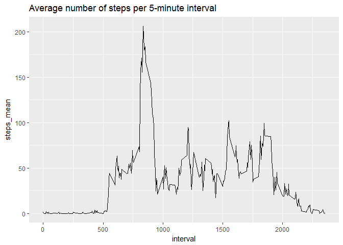
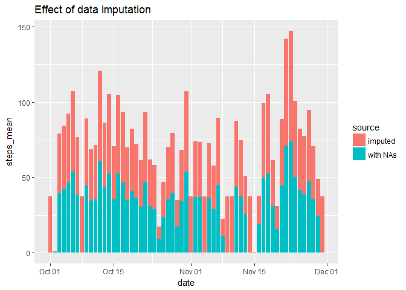

# Reproducible Research: Peer Assessment 1


## Loading and preprocessing the data

Data is read in using `read.csv`. The `date` column is transformed from type `character` to
`Date` with the `ymd` function from the `lubridate` function.


```r
library("ggplot2")
library("dplyr")
```

```
## 
## Attaching package: 'dplyr'
```

```
## The following objects are masked from 'package:stats':
## 
##     filter, lag
```

```
## The following objects are masked from 'package:base':
## 
##     intersect, setdiff, setequal, union
```

```r
read_clean <- function(data = "activity.csv") {
  act <- read.csv("activity.csv")
  act$date <- lubridate::ymd(act$date)
  
  return(act)
}

act <- read_clean()
```

## What is mean total number of steps taken per day?

Histogram showing the total number of steps per day. In addition, the mean and median
number of steps are caculated per day and stored in the `steps_avg` object.


```r
steps_avg <- group_by(act, date) %>% 
  summarise(steps_sum = sum(steps, na.rm = TRUE),
            steps_mean = mean(steps, na.rm = TRUE),
            steps_median = median(steps, na.rm = TRUE))

ggplot(steps_avg, aes(x = date, y = steps_sum)) +
  geom_histogram(stat = "identity") +
  ggtitle("Total number of steps per day")
```

```
## Warning: Ignoring unknown parameters: binwidth, bins, pad
```

<!-- -->

```r
steps_avg
```

```
## # A tibble: 61 × 4
##          date steps_sum steps_mean steps_median
##        <date>     <int>      <dbl>        <dbl>
## 1  2012-10-01         0        NaN           NA
## 2  2012-10-02       126    0.43750            0
## 3  2012-10-03     11352   39.41667            0
## 4  2012-10-04     12116   42.06944            0
## 5  2012-10-05     13294   46.15972            0
## 6  2012-10-06     15420   53.54167            0
## 7  2012-10-07     11015   38.24653            0
## 8  2012-10-08         0        NaN           NA
## 9  2012-10-09     12811   44.48264            0
## 10 2012-10-10      9900   34.37500            0
## # ... with 51 more rows
```

## What is the average daily activity pattern?

The time series shows the average number of steps taken, averaged across all days of each 5-minute interval.


```r
steps_int <- group_by(act, interval) %>% 
  summarise(steps_mean = mean(steps, na.rm = TRUE))

ggplot(steps_int, aes(x = interval, y = steps_mean)) +
  geom_line() +
  ggtitle("Average number of steps per 5-minute interval")
```

<!-- -->

Which 5-minute interval, on average across all the days in the dataset, contains the maximum number of steps?


```r
steps_int$interval[steps_int$steps_mean == max(steps_int$steps_mean)]
```

```
## [1] 835
```


## Imputing missing values

How many missing values are in the dataset?


```r
sum(is.na(act$steps))
```

```
## [1] 2304
```

The missing values are imputed using the average steps per 5-minute interval.


```r
act_full <- left_join(act, steps_int)
```

```
## Joining, by = "interval"
```

```r
ids_na <- is.na(act_full$steps)
act_full$steps[ids_na] <- act_full$steps_mean[ids_na]
```

The mean and median total number of steps taken per day are calculated with the imputed dataset.


```r
steps_avg2 <- group_by(act_full, date) %>% 
  summarise(steps_sum = sum(steps),
            steps_mean = mean(steps), 
            steps_median = median(steps))

ggplot(steps_avg2, aes(x = date, y = steps_sum)) +
  geom_histogram(stat = "identity") +
  ggtitle("Total number of steps per day")
```

```
## Warning: Ignoring unknown parameters: binwidth, bins, pad
```

<!-- -->

Let's compare the average number of steps between the dataset with- and without imputation.


```r
steps_avg$source <- "with NAs"
steps_avg2$source <- "imputed"
comp <- bind_rows(steps_avg, steps_avg2)

ggplot(comp, aes(x = date, y = steps_mean, fill = source)) +
  geom_histogram(stat = "identity") +
  ggtitle("Effect of data imputation")
```

```
## Warning: Ignoring unknown parameters: binwidth, bins, pad
```

```
## Warning: Removed 8 rows containing missing values (position_stack).
```

<!-- -->

Imputing the datasets results in higher average steps for each day.

## Are there differences in activity patterns between weekdays and weekends?

The factor `daytype` indicates if a specific day is a `weekday` (e.g. Monday) or `weekend` (e.g. sunday).


```r
dt <- c("weekend", "weekday")
act_full$day <- weekdays(act_full$date)
act_full$daytype <- factor(ifelse(act_full$day %in% c("Saturday", "Sunday"), "weekend", "weekday"), levels = dt, labels = dt)
```

The time series shows the average number of steps taken, averaged across all days of each 5-minute interval and
daytype (`weekday` and `weekend`).


```r
steps_comp <- group_by(act_full, interval, daytype) %>% 
  summarise(steps_mean = mean(steps))

ggplot(steps_comp, aes(x = interval, y = steps_mean)) +
  geom_line() +
  facet_wrap(~daytype, ncol = 1) +
  ggtitle("Average number of steps per 5-minute interval")
```

<!-- -->


